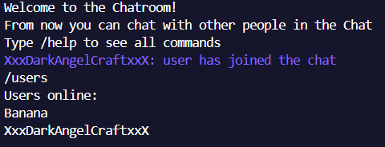

<h1 align='center'>
  
Socket Chatroom

</h1>
 
 
 
 

What is Socket-Chatroom?
-
It's a python made cli chatroom created for a school project.
 
The goal was to create a simple application that use sockets.

 

Prerequisites:
-
- at least version of python 3
 

How to use:
-
- while another sv.py is running you can start the cl.py for connecting your host to the server
- after starting cl.py you must insert the ip address of the server
- type and enjoy
 

Features:
-
- chat with people who are connected on the same server
- use commands for personalizing your experience
 

Commands:
-
- /help : print all commands
- /users : print all users who are online in the room
- /changecol : allow the user to change the color who will seen by others
- /changeu : allow the user to change his username
- /exit : allow the user to exit from the program
 
 
 
  
  
  
  
  
  
written by Vittorio Nunziata
